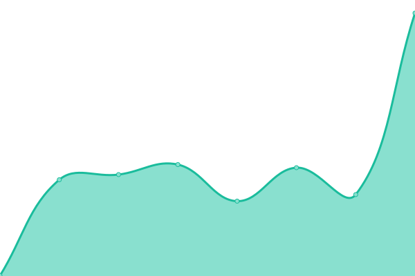
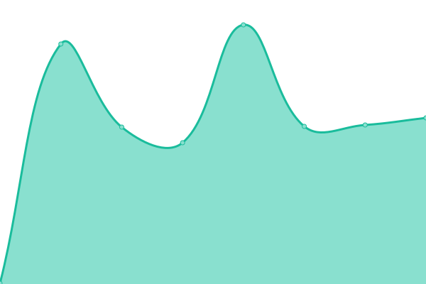
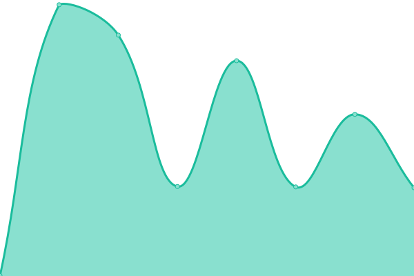
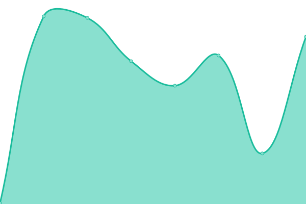
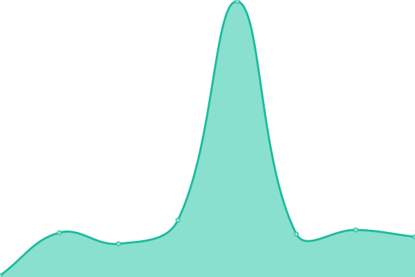
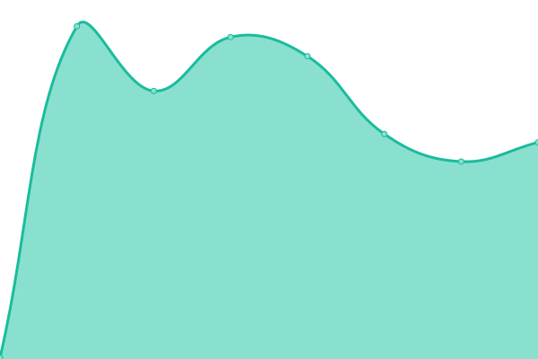

# [📈 Live Status](https://status.englishbay.site): <!--live status--> **🟩 All systems operational**

This repository contains the open-source uptime monitor and status page for [EnglishBay](https://www.englishbay.com.br/), powered by [Upptime](https://github.com/upptime/upptime).

With [Upptime](https://upptime.js.org), you can get your own unlimited and free uptime monitor and status page, powered entirely by a GitHub repository. We use [Issues](https://github.com/EnglishBay/status/issues) as incident reports, [Actions](https://github.com/EnglishBay/status/actions) as uptime monitors, and [Pages](https://status.englishbay.site) for the status page.

<!--start: status pages-->
<!-- This summary is generated by Upptime (https://github.com/upptime/upptime) -->
<!-- Do not edit this manually, your changes will be overwritten -->
<!-- prettier-ignore -->
| URL | Status | History | Response Time | Uptime |
| --- | ------ | ------- | ------------- | ------ |
|  [API](https://api.englishbay.com.br) | 🟩 Up | [api.yml](https://github.com/EnglishBay/status/commits/HEAD/history/api.yml) | 

 352ms
     
 | 

<a href="https://status.englishbay.com.br/history/api">100.00%</a>
    

|  [Frontend](https://app.englishbay.com.br) | 🟩 Up | [frontend.yml](https://github.com/EnglishBay/status/commits/HEAD/history/frontend.yml) | 

 281ms
     
 | 

<a href="https://status.englishbay.com.br/history/frontend">100.00%</a>
    

|  [Admin](https://admin.englishbay.com.br) | 🟩 Up | [admin.yml](https://github.com/EnglishBay/status/commits/HEAD/history/admin.yml) | 

 301ms
     
 | 

<a href="https://status.englishbay.com.br/history/admin">100.00%</a>
    

|  [Blog](https://englishbay.com.br/blog/) | 🟩 Up | [blog.yml](https://github.com/EnglishBay/status/commits/HEAD/history/blog.yml) | 

 210ms
     
 | 

<a href="https://status.englishbay.com.br/history/blog">100.00%</a>
    

|  [Home](https://englishbay.com.br) | 🟩 Up | [home.yml](https://github.com/EnglishBay/status/commits/HEAD/history/home.yml) | 

 35ms
     
 | 

<a href="https://status.englishbay.com.br/history/home">100.00%</a>
    

|  [LP Curso](https://curso.englishbay.com.br) | 🟩 Up | [lp-curso.yml](https://github.com/EnglishBay/status/commits/HEAD/history/lp-curso.yml) | 

 202ms
     
 | 

<a href="https://status.englishbay.com.br/history/lp-curso">100.00%</a>
    

<!--end: status pages-->

[**Visit our status website →**](https://status.englishbay.site)

## 📄 License

- Powered by: [Upptime](https://github.com/upptime/upptime)
- Code: [MIT](./LICENSE) © [EnglishBay](https://www.englishbay.com.br/)
- Data in the `./history` directory: [Open Database License](https://opendatacommons.org/licenses/odbl/1-0/)
